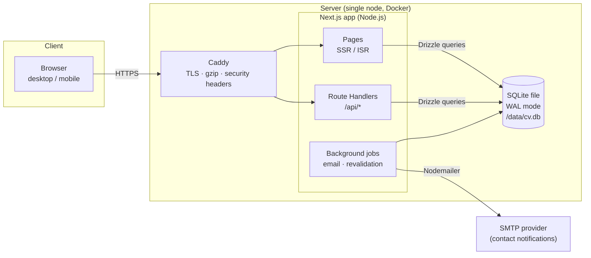
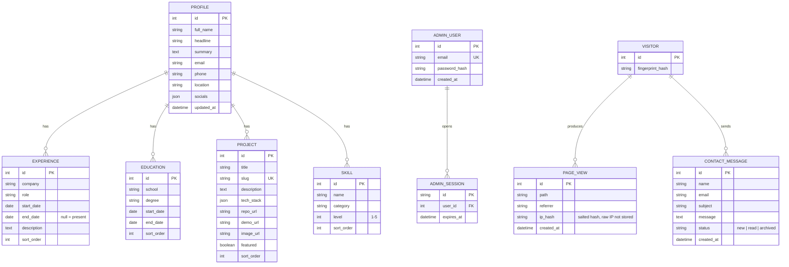
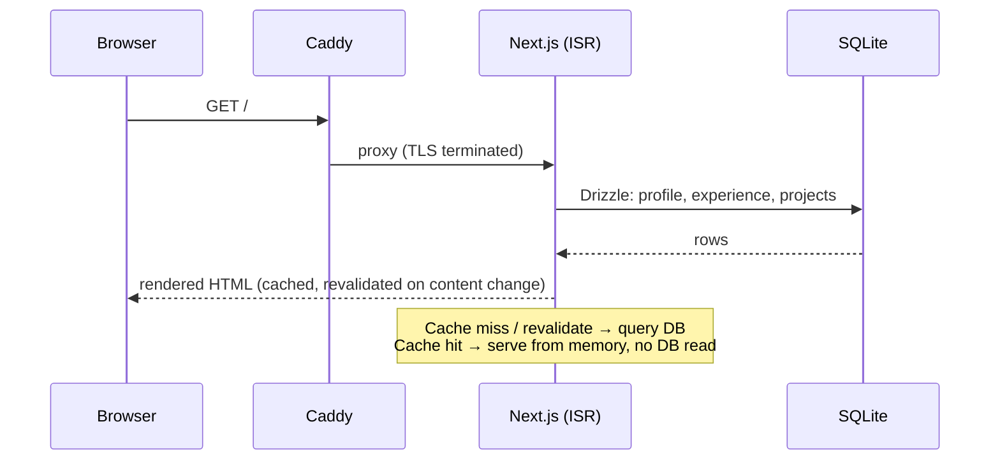
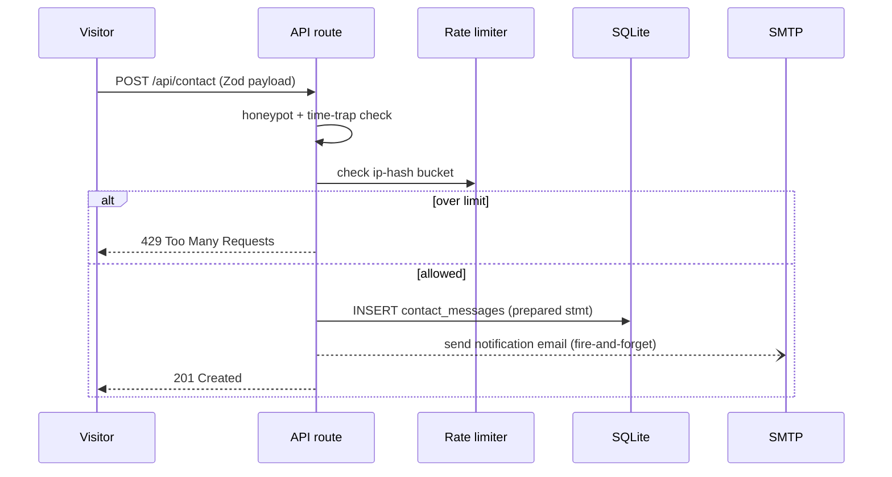

# CV Web — System Architecture

> **Version:** 1.0 · **Last updated:** 2026-10-09 · **Status:** Greenfield (planned)
> **Repository:** https://github.com/bimbangbingbangbung-dotcom/CV-Web

---

## 1. Overview

**CV Web** is a personal résumé / portfolio website. Visitors can browse the owner's profile, experience, projects and skills, and send a contact message. The owner logs in to a small admin area to edit CV content and read messages — no code changes required to update the site.

### Goals

| Goal | Meaning |
|---|---|
| Fast & lightweight | Loads quickly on mobile, works well on cheap hosting |
| Low cost | Runs on a single small server (or free tier where possible) |
| Easy to update | CV content edited through an admin panel, stored in SQLite |
| Maintainable | Standard Next.js conventions, typed end-to-end, minimal moving parts |
| Safe by default | Validated inputs, hashed secrets, rate limiting, automated backups |

### Non-goals (v1)

- Multi-user / public registration system
- Blog CMS with rich text editor (can be added later)
- Horizontal scale-out (single-node architecture is enough for a CV site)

---

## 2. Tech Stack

### Core (chosen)

| Layer | Technology | Why |
|---|---|---|
| Frontend framework | **Next.js** (App Router, latest stable) | React with server-side rendering, file routing, image optimization and ISR caching built in |
| UI library | **React** | Component model, ecosystem, hiring-market standard |
| Styling / UI-UX | **Tailwind CSS v4** | Utility-first styling, design tokens via CSS variables, dark mode for free |
| Backend | **Next.js Route Handlers** (Node.js runtime) | API lives in the same app — one deployable, no separate server to manage |
| Database | **SQLite** (WAL mode) | Zero-ops, single-file, perfectly sufficient for a personal site; backed up by copying one file |

### Added as necessary

| Concern | Technology | Why it's needed |
|---|---|---|
| Language | **TypeScript** | Type safety across frontend, API and DB — catches mistakes before runtime |
| DB access layer | **Drizzle ORM** + `better-sqlite3` | Typed queries, migrations, and safe prepared statements (SQL-injection protection) out of the box |
| Validation | **Zod** | One schema validates both API input and form data; generates TS types automatically |
| Forms | **React Hook Form** | Handle submit states, errors and accessibility with little boilerplate |
| UI components | **shadcn/ui** (Radix primitives + Tailwind) | Accessible dialogs/menus/toast out of the box, still fully Tailwind-styled |
| Icons | **lucide-react** | Consistent icon set matching the Tailwind aesthetic |
| Auth (admin) | **Auth.js (NextAuth)** — credentials provider | Session cookie login for `/admin` without building sessions from scratch |
| Password hashing | **bcryptjs** (or Argon2) | Admin password never stored in plain text |
| Email (contact notifications) | **Nodemailer → SMTP** (or Resend API) | Owner gets an email when someone submits the contact form |
| Runtime | **Node.js LTS (22+)** with **pnpm** | pnpm is fast, strict about dependencies |
| Containerization | **Docker** + **Docker Compose** | Identical dev/prod environments, one-command deploys |
| Reverse proxy / TLS | **Caddy** (alternative: Nginx) | Automatic HTTPS, gzip/brotli, security headers — ~10 lines of config |
| Testing | **Vitest** (unit) + **Playwright** (E2E) | Keeps forms, auth and rendering regression-free |
| Lint / format | **ESLint** + **Prettier** | Consistent code style, enforced in CI |
| CI/CD | **GitHub Actions** | Lint → test → build → Docker image on every push |
| Analytics | **Page-view logging into SQLite** (privacy-friendly, IP-hashed) | Avoids third-party trackers; simple `page_views` table is enough |

### Deliberate constraints

- **SQLite ⇒ no serverless hosting.** Vercel/Netlify functions have ephemeral filesystems; the DB file would vanish. Deployment target is a **VPS or Fly.io/Railway volume with Docker** (see §8).
- **No separate API server.** For this scale, splitting frontend/backend would double the ops surface for zero benefit. Route Handlers keep one deployable while remaining cleanly separated in code.

---

## 3. High-Level Architecture



**Request path:** Browser → Caddy (TLS, caching headers) → Next.js → Drizzle ORM → SQLite file → rendered HTML / JSON response.

---

## 4. Project Structure

```text
cv-web/
├── app/
│   ├── (public)/
│   │   ├── page.tsx                 # Home — CV overview (ISR)
│   │   ├── projects/
│   │   │   ├── page.tsx             # Project list
│   │   │   └── [slug]/page.tsx      # Project detail
│   │   └── contact/page.tsx
│   ├── admin/
│   │   ├── login/page.tsx
│   │   ├── layout.tsx               # auth guard
│   │   └── (dashboard)/             # content + messages editors
│   ├── api/
│   │   ├── contact/route.ts         # POST contact form
│   │   ├── healthz/route.ts         # uptime probe
│   │   └── admin/...                # CRUD + auth endpoints
│   ├── layout.tsx                   # shell, fonts (next/font), theme
│   ├── globals.css                  # Tailwind entry
│   └── sitemap.ts · robots.ts
├── components/                      # ui/ (shadcn) · sections/ · forms/
├── lib/
│   ├── db/
│   │   ├── client.ts                # better-sqlite3 + Drizzle singleton
│   │   ├── schema.ts                # table definitions
│   │   └── migrations/
│   ├── validation/                  # Zod schemas
│   ├── auth.ts                      # Auth.js config
│   ├── email.ts                     # Nodemailer transport
│   ├── rate-limit.ts                # DB-backed sliding window
│   └── utils.ts
├── drizzle.config.ts
├── tests/                           # vitest/ + e2e/
├── Dockerfile · docker-compose.yml · Caddyfile
├── .env.example
├── next.config.ts · tailwind.config.ts · tsconfig.json
└── .opencode/                       # OpenCode config (auto-sync plugin)
```

---

## 5. Data Model (SQLite)



**Notes**

- All content tables live behind the admin panel; public pages read them server-side (no public write endpoints except the contact form).
- `page_views.ip_hash` stores a salted hash only — no raw IPs (privacy).
- SQLite runs in **WAL mode** with `busy_timeout`; Drizzle issues only prepared statements.

---

## 6. API Surface

Public pages are server-rendered directly from the DB — no public JSON API needed in v1.

| Method | Endpoint | Auth | Purpose |
|---|---|---|---|
| `POST` | `/api/contact` | — (rate-limited, honeypot) | Store message + email notification |
| `GET` | `/api/healthz` | — | Liveness probe for uptime monitoring |
| `POST` | `/api/admin/login` | — | Credentials login → session cookie |
| `POST` | `/api/admin/logout` | session | Clear session |
| `GET/PUT` | `/api/admin/profile` | session | Edit profile block |
| `GET/POST/PATCH/DELETE` | `/api/admin/{experiences|educations|projects|skills}` | session | CRUD on CV sections |
| `GET/PATCH` | `/api/admin/messages` | session | List / mark contact messages |
| `GET` | `/api/admin/stats` | session | Visitors, top pages |

**Conventions:** Zod-validated JSON bodies · `401` without a valid session · errors return `{ error: { code, message } }` · all mutating endpoints check `Origin` + SameSite cookies (CSRF).

---

## 7. Key Flows

### 7.1 Public page render (fast path)



Public pages use **ISR** (`revalidateTag`): after an admin edit, the app revalidates the tag so visitors see changes within seconds — yet traffic doesn't hammer the DB.

### 7.2 Contact form submission



### 7.3 Admin edit → live update

1. Owner logs in at `/admin/login` (bcrypt compare → Auth.js session cookie, `httpOnly`, `Secure`, `SameSite=Lax`).
2. Edit form → `PUT /api/admin/...` → Zod validation → Drizzle update → `revalidateTag("cv")`.
3. Next request for public pages serves fresh content.

---

## 8. Deployment & Environments

### Environments

| Env | How it runs | DB file |
|---|---|---|
| **Development** | `pnpm dev` on the laptop | `./data/dev.db` (git-ignored) |
| **Production** | Docker Compose on a VPS: `app` + `caddy` containers, named volume `/data` | `/data/cv.db` (persisted + backed up) |

### Docker Compose (shape)

```yaml
services:
  app:
    build: .
    env_file: .env
    volumes:
      - cv-data:/data          # SQLite lives here
    restart: unless-stopped
  caddy:
    image: caddy:2
    ports: ["80:80", "443:443"]
    volumes:
      - ./Caddyfile:/etc/caddy/Caddyfile
      - caddy-data:/data
      - caddy-config:/config
volumes:
  cv-data:
  caddy-data:
  caddy-config:
```

### Environment variables (`.env.example`)

```dotenv
DATABASE_URL=file:/data/cv.db
AUTH_SECRET=            # openssl rand -base64 32
ADMIN_EMAIL=
SESSION_TTL_DAYS=7
SMTP_HOST= SMTP_PORT=587 SMTP_USER= SMTP_PASS=
EMAIL_TO=               # where contact notifications go
SITE_URL=https://example.com
RATE_LIMIT_PER_MINUTE=5
```

### CI/CD (GitHub Actions)

`push` → install (pnpm cache) → lint → unit tests → `next build` → (on `main`) build & push Docker image → SSH/`compose pull && up` on the server.

### Backups (critical — it's one file, keep it easy)

- Nightly `sqlite3 cv.db ".backup '/backups/cv-$(date).db'"` (online backup API — safe with WAL).
- Copy backups off-server (rclone → S3/Drive), retain 7 daily + 4 weekly.
- Restore = stop app, copy file back, start app. Documented and **tested quarterly**.

---

## 9. Security

| Risk | Mitigation |
|---|---|
| SQL injection | Drizzle prepared statements only — no string-built SQL |
| XSS | React auto-escaping; CSP header via Caddy; no `dangerouslySetInnerHTML` without sanitization |
| CSRF | SameSite=Lax cookies + `Origin` check on mutations |
| Brute force (login, contact) | DB-backed sliding-window rate limit by salted IP hash; login adds exponential backoff |
| Credential theft | bcrypt hashes; `AUTH_SECRET` only in `.env` (never committed); rotate on suspicion |
| Spam bots | Honeypot field + minimum-fill-time trap + rate limit |
| Transport | HTTPS enforced by Caddy (auto-renew), HSTS header |
| Secrets in logs | `.env` git-ignored; error pages never echo stack traces in production |
| Dependencies | `pnpm audit` in CI; Dependabot alerts on |

---

## 10. Performance

- **ISR + `revalidateTag`** on all public pages — most requests never touch the DB.
- **`next/image`** with WebP/AVIF, sized variants; **`next/font`** self-hosted fonts (no Google Fonts round-trip).
- Tailwind purges unused CSS; JS split per route — homepage ships only what it needs.
- Caddy serves `immutable` cache headers for hashed assets, gzip/brotli for text.
- SQLite in WAL mode with covering indexes on `slug`, `sort_order`, `created_at`.
- Budget: **LCP < 1.5 s on 4G mobile, Lighthouse ≥ 95** (checked in CI via Lighthouse CI, optional).

---

## 11. Observability & Operations

- `/api/healthz` → monitored by **Uptime Kuma** (or UptimeRobot) with alert on downtime.
- Caddy access logs (rotated) + Next.js structured logs → `docker compose logs`.
- Weekly digest available in `/admin/stats` (views, top pages, messages).
- Runbook: restart (`docker compose restart app`), backup restore, cert issues — documented in `docs/RUNBOOK.md` (planned).

---

## 12. Evolution Path (future, not v1)

| If we need… | Then… |
|---|---|
| More traffic / HA | Move to Postgres (Drizzle schema ports over), add replicas |
| Richer CMS | Add MDX-based blog or integrate PayloadCMS |
| Global CDN caching | Cloudflare in front of Caddy (proxy mode) |
| Multi-language CV | `next-intl` with per-locale routes |
| PWA / offline | `manifest.json` + service worker |

---

## 13. Development Workflow

- **Auto-sync:** the OpenCode `autosync` plugin commits & pushes every change to GitHub automatically (`.opencode/plugins/autosync/`).
- **Branching:** `main` always deployable; feature branches → PR → CI green → merge.
- **Commits:** Conventional Commits (`feat:`, `fix:`, `docs:`).
- **Setup:** `pnpm install && cp .env.example .env && pnpm db:migrate && pnpm dev`.
